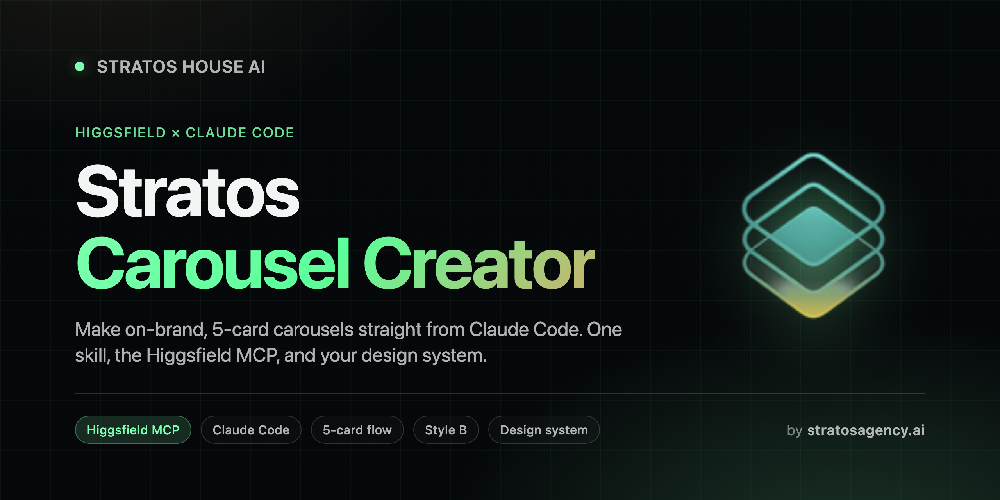

<div align="center">
  
</div>

<h1 align="center">Stratos Carousel Creator</h1>

<p align="center">
  <strong>Make on-brand, 5-card Instagram carousels straight from Claude Code.</strong><br/>
  One skill, the Higgsfield MCP, and your design system.
</p>

<p align="center">
  <a href="#install"></a>
  <a href="https://higgsfield.ai/mcp"></a>
  <a href="LICENSE"></a>
  <a href="https://www.stratosagency.ai"></a>
</p>

<p align="center">
  <a href="https://stratos-carousel-guide.vercel.app"><strong>📖 Read the full guide →</strong></a>
</p>

---

## What this is

A Claude Code skill that turns one short brief into a finished, on-brand **5-card Instagram carousel**, rendered through the Higgsfield MCP. The five cards read as one story, not five posters: a recurring sculpture moves through the swipe on an S-curve. It greets, watches, takes over, mirrors, then exits.

It ships with the Stratos "Style B" look by default, and it is **re-skinnable** — swap the design context and the same pipeline renders your brand.

```
  Cover  →  Headline 01  →  Punctuation tile  →  Headline 03  →  List + CTA
  (greet)   (watch)         (take over)          (mirror)        (exit)
```

## How it works

You give it a brief (a date, your top 3 stories, and optionally 5 supporting titles). The skill then:

1. **Derives today's rules** — reads the date and looks up the weekday rotation (sculpture position + warm/cool emphasis).
2. **Renders 5 cards in parallel** — builds five prompts from the flow rules and your design context, fires them all at the Higgsfield MCP at once.
3. **Runs a QA pass** — checks every card against the locked checklist (numerals cyan, hairlines gold, body cream, no emoji, voice clean) and re-renders any that fail.
4. **Delivers** — saves the set to `./carousel/{date}/`, reports the credit cost, and hands it to you to approve or re-render.

About **15 credits** per carousel on the default model. Higgsfield's free tier (150 credits/month) covers roughly ten.

## The three pieces

| Piece | What it does |
|---|---|
| **[Higgsfield MCP](https://higgsfield.ai/mcp)** | The image/video studio Claude drives to actually render the cards. OAuth, no API keys. |
| **Design context** | A one-page brief (palette, type, layout, voice) you load so every render stays on-brand. |
| **This skill** | The flow + prompt grammar + QA that turns a brief into five finished cards. |

## Install

First, connect Higgsfield (one command, then a browser sign-in):

```bash
claude mcp add --transport http --scope user higgsfield https://mcp.higgsfield.ai/mcp
```

Then in Claude Code, run `/mcp` → select `higgsfield` → **Authenticate**.

Now add the skill:

```text
/plugin marketplace add ArshiaEcho/stratos-carousel-creator
/plugin install stratos-carousel-creator@stratos
```

Trigger it:

```text
/stratos-carousel-creator
```

> This repo is **private**. Make sure your GitHub account has access and you are signed in (`gh auth login`). You can also clone it straight into your project's `.claude/skills/` directory.

## Repo layout

```
stratos-carousel-creator/
├── plugin/
│   ├── .claude-plugin/plugin.json
│   └── skills/stratos-carousel-creator/
│       ├── SKILL.md                      the pipeline
│       └── references/
│           ├── flow-system.md            the 5-card flow + rotation + QA
│           ├── prompt-templates.md        the 5 card prompts (self-contained)
│           └── design-context.md          the design brief to load (swappable)
├── docs/
│   ├── 01-higgsfield-mcp-setup.md         connect + authenticate
│   ├── 02-design-system.md                why + how (Claude Design)
│   ├── 03-prompting.md                    model choice + prompt grammar + cost
│   └── 04-carousel-flow.md                the flow + install + usage
├── assets/                                logo, favicon, OG card
├── .claude-plugin/marketplace.json
└── README.md
```

## Make it yours

The skill renders Stratos carousels out of the box. To build your own brand's engine, edit `references/design-context.md` (palette, type, voice) and, if you want, the hero element and rotation in `references/flow-system.md`. The pipeline does not change. The look does.

Not a designer? Use **Claude Design** — Claude's own design ability — to generate your palette, type, layout, and voice rules first, then distill them into the one-page design context. That is exactly how the Stratos system was made.

## Why a design system matters

Higgsfield is only as on-brand as the context you hand it. A blank prompt gives a generic card. A loaded design system is the difference between five posts that look like five tools made them, and a feed that looks like one studio. It is the highest-leverage thing you load before a render.

## Credits

- Built on the **[Higgsfield MCP](https://higgsfield.ai/mcp)** for rendering.
- Design system generated with **Claude Design** and distilled into a portable brief.
- Companion to the **[Stratos Memory Stack](https://github.com/ArshiaEcho/stratos-memory-stack)**.

## Share this

If this helped you, send it to someone else who uses Claude Code. Keep the name "Stratos Carousel Creator" so they can find updates.

Compiled by **Stratos House AI** (Arshia Navabi). MIT licensed.

---

<div align="center">
  <sub>
    <a href="https://stratos-carousel-guide.vercel.app">guide</a>
    &nbsp;·&nbsp;
    <a href="https://www.stratosagency.ai">stratosagency.ai</a>
    &nbsp;·&nbsp;
    <a href="https://github.com/ArshiaEcho/stratos-carousel-creator/issues">issues</a>
  </sub>
</div>
